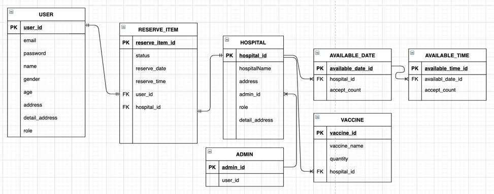

## Reserve-Web-App

***
## 🚀 프로젝트 개요

2021/8/2 프로젝트 시작

코로나19 예방접종 예약 시스템 백엔드 Clone 프로젝트

(+ Github를 이용한 협업 연습)
***

## 🚀 사용 기술

프레임워크: `Spring boot` 2.5.x

IDE: `Intellij`

ORM: `JPA` (Hibernate, Spring Data JPA)

DBMS: `MySQL`, 테스트(`h2`)

템플릿엔진: `Thymeleaf`

- Spring Dependencies
  - `Spring web`
  - `Spring Data JPA`
  - `Spring Security`
  - `Spring Oauth2 client`
  - `Spring Validation`
  - `Lombok`
  - `ModelMapper`
***
  
## 🔎 구현 예정 기능
***
### Admin 측 기능 (수정중)

- `병원등록`
  - 병원에 대한 기본 정보 입력 (이름, 주소 ...)
  - 예약가능날짜, 예약가능시간, 일일 최대예약가능 인원, 시간당 최대예약가능 인원, 접종가능백신(종류별 수량) 입력
- `등록된 병원 목록` (조회)
  - 병원 삭제
- `등록된 병원 상세 페이지` (조회, 수정)
  - 등록된 병원 정보 수정
- `현황 조회`
  - 날짜별, 시간별 예약현황 확인
  - 잔여백신 현황 확인
***

### Client 측 기능 (수정중)

- `본인인증` ( `Oauth2` - `Naver`, `Kakao`, `Google`)
- `예약`
  - 병원선택 -> 예약날짜선택 -> 예약시간선택 -> 백신선택
- `예약확인`
- `예악한 병원 길찾기`

***

# 🚀 ERD

- 한 명의 `USER`는 한 개의 `예약서(RESERVE_ITEM)`를 가진다.
- 한 개의 `예약서(RESERVE_ITEM)`는 한 개의 `병원(HOSPITAL)`을 가진다.
- 한 명의 `관리자(ADMIN)`은 여러 `병원(HOSPITAL)`을 가진다.
- 한 개 병원은 여러 `예약가능날짜(AVAILABLE_DATE)`를 가진다.
- 한 개 `예약가능날짜(AVAILABLE_DATE)`는 여러 `예약가능시간(AVAILABLE_TIME)`을 가진다.
- 한 개 병원은 여러 `백신(VACCINE)`을 가진다. (여러 종류의 백신)

***

# 🌡 기능시연

#### < Admin 병원등록 >

#### < Admin 병원정보 수정 >

#### < 예약하고자 하는 병원 검색 >

#### < 백신 예약 >

#### < Admin 예약현황 조회 >

***

## 👨‍👨‍👦 팀원
***
### BACKEND
### 🧑‍💻 김대현

### 🧑‍💻 홍성진

***
### Frontend
### 🧑‍💻 김윤성

